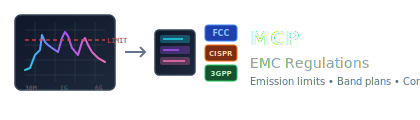

<p align="center">
  
</p>

<p align="center">
  <strong>EMC/RF regulatory lookup for engineers via MCP</strong>
</p>

<p align="center">
  <a href="#features">Features</a> •
  <a href="#installation">Installation</a> •
  <a href="#tools">Tools</a> •
  <a href="#examples">Examples</a>
</p>

---

An MCP server providing instant access to EMC emission limits, frequency allocations, restricted bands, and compliance requirements. Query FCC Part 15, CISPR, automotive, medical, and cellular standards directly from Claude Code.

## Features

### FCC (United States)
- **Part 15.109** - Radiated emission limits (Class A/B)
- **Part 15.207** - Conducted emission limits
- **Part 15.209** - Radiated emission limits (intentional radiators)
- **Part 15.205** - Restricted frequency bands
- **Part 18** - ISM equipment limits and bands

### CISPR (International)
- **CISPR 11** - Industrial, scientific, medical equipment
- **CISPR 32** - Multimedia equipment (replaces CISPR 22)
- **CISPR 14-1** - Household appliances
- **Limit comparison** - FCC vs CISPR with distance correction

### Cellular (3GPP)
- **LTE bands** - All E-UTRA bands with frequencies, duplex, bandwidths
- **5G NR bands** - FR1 (sub-6 GHz) and FR2 (mmWave)
- **US carrier info** - AT&T, Verizon, T-Mobile band assignments
- **Frequency lookup** - Find which bands contain a frequency

### Coming Soon
- CISPR 25 (Automotive components)
- IEC 60601-1-2 (Medical devices)
- PTCRB certification requirements

## Installation

### 1. Clone and install

```bash
git clone https://github.com/RFingAdam/mcp-emc-regulations.git
cd mcp-emc-regulations
uv pip install -e .
```

### 2. Add to Claude Code

```bash
claude mcp add emc-regulations -- uv run --directory /path/to/mcp-emc-regulations mcp-emc-regulations
```

Or manually add to `~/.claude.json`:

```json
{
  "mcpServers": {
    "emc-regulations": {
      "command": "uv",
      "args": ["run", "--directory", "/path/to/mcp-emc-regulations", "mcp-emc-regulations"]
    }
  }
}
```

## Tools

### EMC Limits

| Tool | Description |
|------|-------------|
| `fcc_part15_limit` | Get FCC Part 15 limits (15.109, 15.207, 15.209) |
| `fcc_part18_limit` | Get FCC Part 18 ISM equipment limits |
| `cispr_limit` | Get CISPR 11/22/32/14-1 limits |
| `emc_compare_limits` | Compare FCC vs CISPR limits at a frequency |

### Frequency Bands

| Tool | Description |
|------|-------------|
| `fcc_restricted_bands` | Check if frequency is in 15.205 restricted band |
| `fcc_restricted_bands_list` | List all restricted bands |
| `ism_bands_list` | List all ISM frequency bands |

### Cellular

| Tool | Description |
|------|-------------|
| `lte_band_lookup` | Look up LTE band by number |
| `lte_bands_list` | List LTE bands (filter by region/carrier) |
| `nr_band_lookup` | Look up 5G NR band by name (n77, n260) |
| `nr_bands_list` | List NR bands (FR1, FR2, by carrier) |
| `frequency_to_band` | Find which LTE/NR bands contain a frequency |

### Reference

| Tool | Description |
|------|-------------|
| `emc_standards_list` | List all available standards |
| `ecfr_query` | Query eCFR API for CFR regulatory text |

## Examples

### Check FCC Part 15 limits
```
What are the FCC Part 15 Class B radiated limits at 100 MHz?
```
→ Returns 43.5 dBuV/m @ 3m (quasi-peak)

### Compare FCC vs CISPR
```
Compare FCC and CISPR Class B limits at 200 MHz
```
→ Shows both limits with distance correction notes

### Check restricted bands
```
Is 121.5 MHz a restricted band?
```
→ Yes - aeronautical emergency frequency

### Look up LTE band
```
What frequencies does LTE Band 7 use?
```
→ UL: 2500-2570 MHz, DL: 2620-2690 MHz (FDD)

### Find carrier bands
```
What 5G bands does T-Mobile use?
```
→ Low: n71, Mid: n41/n77, mmWave: n260/n261

### Frequency to band lookup
```
What cellular bands use 3500 MHz?
```
→ LTE Band 42, NR n77, NR n78

### Check ISM bands
```
Is 2.45 GHz in an ISM band?
```
→ Yes - 2400-2500 MHz ISM band

## Data Sources

| Source | Type | Coverage |
|--------|------|----------|
| eCFR API | Live | 47 CFR (FCC regulations) |
| 3GPP TS 36.101 | Curated | LTE band definitions |
| 3GPP TS 38.101 | Curated | NR band definitions |
| CISPR standards | Curated | Emission limits |

## License

MIT
